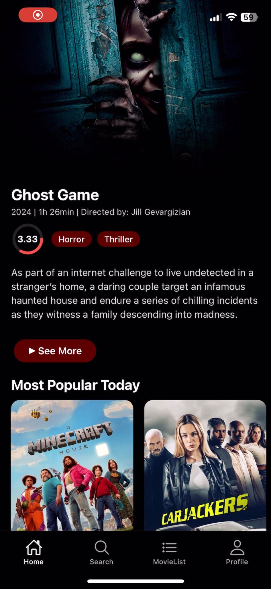
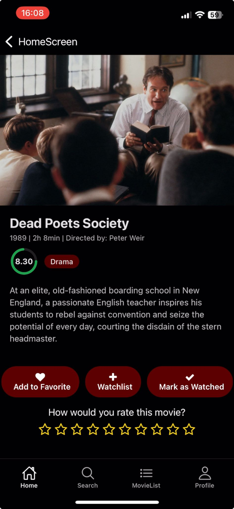
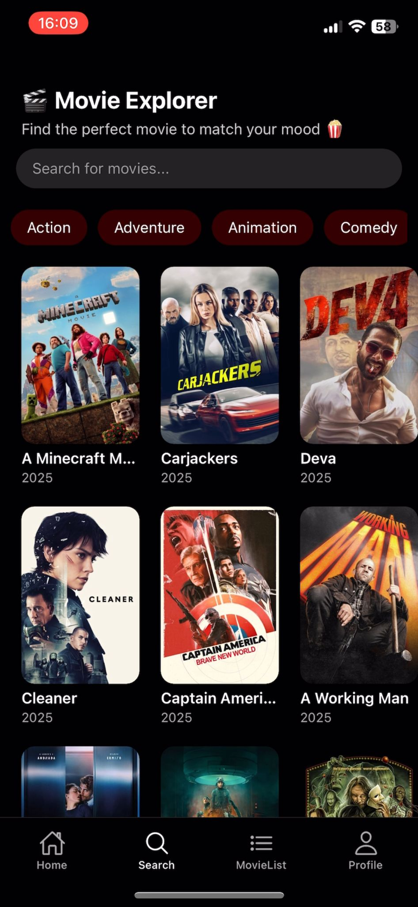
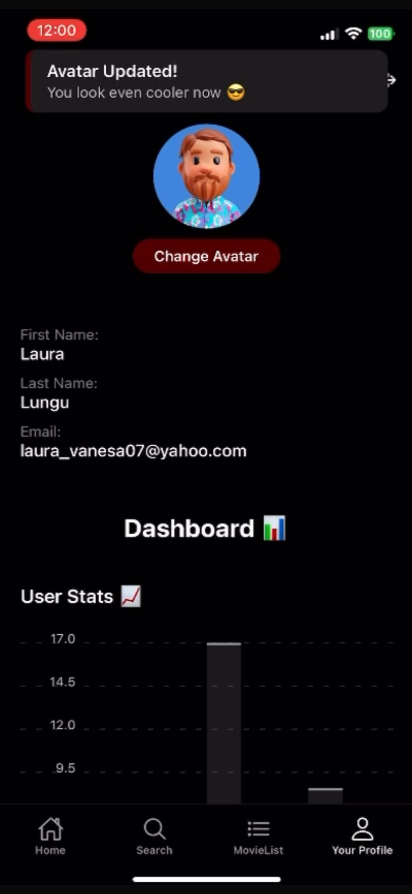

# Echipa B4 – Testarea unei aplicații mobile 📱

## Linkuri proiect
- 📌 **Documentație completă (PDF):**  [aici](Documentatie_TSS_Testarea_unei_aplicații_mobile.pdf).
- 📊 **Prezentare PPT (PDF):** [aici](Prezentare_TSS_Testarea_unei_aplicatii_mobile.pdf)  
- 📹 **Demo aplicație:** [aici](https://youtu.be/RyaEcpjbC_Q).
- 📹 **Demo testare Maestro:** [aici](https://youtube.com/shorts/_i81mKKKZoQ).
- :clipboard: **Raport despre folosirea unui tool AI:** [aici](raportAI.md)

---

### :warning: Adaptare backend din proiect web existent
Pentru a eficientiza procesul de dezvoltare și a reutiliza o bază solidă de cod, backend-ul aplicației MovieMingle a fost preluat dintr-un proiect de al nostru anterior cu versiune web. Acesta este construit în Java Spring Boot, conține deja logica de recomandare și endpoint-urile necesare, și a fost adaptat pentru a răspunde nevoilor unei aplicații mobile. Link-ul către repo-ul aplicației web se poate accesa [aici](https://github.com/unibuc-cs/software-engineering-product-4errors).

---

## MovieMingle 🎬 - Descriere Generală
  
**MovieMingle** este o aplicație mobile care recomandă filme utilizatorilor pe baza preferințelor lor. Aplicația îmbunătățește experiența de vizionare prin predicții realizate cu ajutorul tehnicilor de învățare automată. Cu o interfață prietenoasă și un design modern și atrăgător, MovieMingle devine partenerul ideal pentru pasionații de film care caută titluri noi, potrivite gusturilor lor. Indiferent dacă preferi drame, comedii sau thrillere, aplicația va oferi recomandări care se potrivesc așteptărilor tale.

## 📸 Screenshots din aplicație:

              

## 🧱 Arhitectura aplicației și tehnologiile folosite
- **Frontend (Mobile)**: aplicație **React Native** care oferă o interfață intuitivă pentru utilizatori.
- **Backend (Server)**: serviciu **Java Spring Boot** ce gestionează logica de business, înregistrarea utilizatorilor, salvarea filmelor, scoruri, watchlist etc.
- **Sistem de recomandare**: algoritm bazat pe **colaborative filtering**, implementat în backend.
- **Bază de date**: **MySQL**, utilizată pentru stocarea permanentă a utilizatorilor, filmelor, ratingurilor și token-urilor de autentificare.
- **Serviciu extern - TMDB API**: aplicația consumă date de la **The Movie Database (TMDB)** pentru a obține informații actualizate despre filme, cum ar fi titlul, posterul, durata, genul și descrierea. API-ul este accesat direct din backend printr-un client REST personalizat.
  

## 🛠️ Framework-uri de testare utilizate

În cadrul acestui proiect, am folosit mai multe framework-uri moderne, specifice atât pentru testare frontend cât și backend:

| Framework | Tip Testare | Scop | Tehnologie |
|----------|-------------|------|-------------|
| **Jest** + React Native Testing Library | Unitare + Integrare + Performanță + Accesibilitate (Frontend) | Testare componentă + comportament UI | JavaScript |
| **Maestro** | End-to-End (Frontend) | Testare flow-uri reale pe emulator | YAML + Emulator Android |
| **JUnit 5** + Mockito | Unitare + Integrare + Funcționale (Backend) | Testare servicii izolate cu mock-uri | Java |
| **TestNG** | Unitare + Funcționale + Integrare (Backend) | Testare completă cu scenarii reale | Java |
| **JaCoCo** | Analiză acoperire | Măsurare cod acoperit cu teste | Java + Maven |

Această combinație ne-a permis să validăm atât logică internă, cât și funcționalități complete, în scenarii realiste de utilizator.

