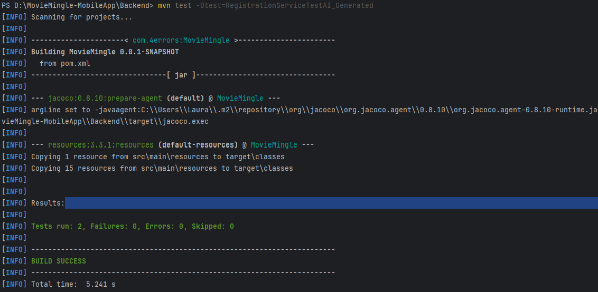

# 🤖Raport despre folosirea unui tool AI în testare

### 📌 Obiectiv

În cadrul acestui proiect, am folosit **ChatGPT (OpenAI)** pentru a genera automat o suită de teste unitare pentru clasa `DefaultAppUserService`, responsabilă cu logica de înregistrare a utilizatorilor. Scopul a fost să comparăm testele scrise manual cu cele generate de AI, observând diferențele în claritate, structură și acoperirea logicii.

* **Tool AI folosit**: [ChatGPT (OpenAI)](https://chat.openai.com)
* **Data generării**: 15 mai 2025
* **Model AI**: GPT-4
* **Scop**: Generare de teste unitare pentru metodele `register()` și `checkIfUserExist()`

---

### Testele generate de noi

```java
@ExtendWith(MockitoExtension.class)
public class DefaultAppUserServiceTestJUnit {

    @Mock
    private AppUserRepository userRepository;

    @Mock
    private PasswordEncoder passwordEncoder;

    @Mock
    private EmailService emailService;

    @Mock
    private SecureTokenService secureTokenService;

    @Mock
    private SecureTokenRepository secureTokenRepository;


    @InjectMocks
    private DefaultAppUserService userService;


    private RegisterDto registerDto;
    private AppUser appUser;

    @BeforeEach
    public void setUp() {
        registerDto = new RegisterDto();
        registerDto.setEmail("test@example.com");
        registerDto.setPassword("password");
        registerDto.setFirstName("User");
        registerDto.setLastName("Test");

        appUser = new AppUser();
        appUser.setEmail("test@example.com");
        appUser.setPassword("encodedPassword");
        appUser.setFirstName("User");
        appUser.setLastName("Test");
        appUser.setRole("user");
        appUser.setCreatedAt(new Date());
        appUser.setAvatar("avatar1.jpg");
    }

    @Test
    public void testRegister_UserAlreadyExists() {
        // simulam gasirea unui user existent
        when(userRepository.findByEmail(registerDto.getEmail())).thenReturn(appUser);

        // verificam ca nu se salveaza ptc se arunca exceptia UserAlreadyExistsException
        assertThrows(UserAlreadyExistsException.class, () -> {
            userService.register(registerDto);
        });
        verify(userRepository, never()).save(any(AppUser.class));
    }


    @Test
    public void testRegister_Success() throws UserAlreadyExistsException, MessagingException {
        // simulam salvarea user-ului nou
        when(userRepository.findByEmail(registerDto.getEmail())).thenReturn(null);
        when(passwordEncoder.encode(registerDto.getPassword())).thenReturn("encodedPassword");
        when(userRepository.save(any(AppUser.class))).thenReturn(appUser);

        // configuram SecureTokenService sa returneze un SecureToken valid
        SecureToken secureToken = new SecureToken();
        secureToken.setToken("valid-token");
        when(secureTokenService.createSecureToken()).thenReturn(secureToken);
        when(secureTokenRepository.save(any(SecureToken.class))).thenReturn(secureToken);

        // setam valoarea pentru baseURL folosind ReflectionTestUtils
        ReflectionTestUtils.setField(userService, "baseURL", "http://localhost:8080");

        userService.register(registerDto);

        // verificam
        assertEquals("test@example.com", appUser.getEmail());
        assertEquals("encodedPassword", appUser.getPassword());
        assertEquals("User", appUser.getFirstName());
        assertEquals("valid-token", secureToken.getToken());

        verify(userRepository, times(1)).findByEmail(registerDto.getEmail());
        verify(passwordEncoder, times(1)).encode(registerDto.getPassword());
        verify(userRepository, times(1)).save(any(AppUser.class));
        verify(emailService, times(1)).sendMail(any());
        verify(secureTokenRepository, times(1)).save(any(SecureToken.class));
    }

    @Test
    public void testEncodePassword() {
        RegisterDto registerDto = new RegisterDto();
        registerDto.setPassword("plainPassword");
        AppUser appUser = new AppUser();

        // setam comportamentul mock-ului pentru passwordEncoder
        when(passwordEncoder.encode("plainPassword")).thenReturn("encodedPassword");

        // apelam metoda privata encodePassword tot prin reflectie
        ReflectionTestUtils.invokeMethod(userService, "encodePassword", registerDto, appUser);

        // verificam ca parola a fost codificata corect
        assertEquals("encodedPassword", appUser.getPassword());
        verify(passwordEncoder, times(1)).encode("plainPassword");
    }

    @Test
    public void testCheckIfUserExist_UserExists() {
        String email = "test@example.com";
        when(userRepository.findByEmail(email)).thenReturn(appUser);
        boolean userExists = userService.checkIfUserExist(email);
        assertTrue(userExists);
        verify(userRepository, times(1)).findByEmail(email);
    }

    @Test
    public void testCheckIfUserExist_UserDoesNotExist() {
        String email = "nonexistent@example.com";
        when(userRepository.findByEmail(email)).thenReturn(null);
        boolean userExists = userService.checkIfUserExist(email);
        assertFalse(userExists);
        verify(userRepository, times(1)).findByEmail(email);
    }
}
```

---

### 📥 Prompt utilizat

```text
Scrie o clasă de test unitar folosind JUnit 5 și Mockito pentru serviciul DefaultAppUserService,
care conține metodele register() și checkIfUserExist(). Simulează comportamentul repository-ului
și serviciilor auxiliare, și scrie două teste: unul pentru cazul în care utilizatorul există deja
și altul pentru înregistrare reușită.
```

---

### Testele generate de AI [1]

```java
@ExtendWith(MockitoExtension.class)
class RegistrationServiceTest {

    @Mock
    private AppUserRepository userRepository;

    @Mock
    private PasswordEncoder passwordEncoder;

    @Mock
    private SecureTokenService secureTokenService;

    @Mock
    private EmailService emailService;

    @Mock
    private SecureTokenRepository secureTokenRepository;

    @InjectMocks
    private DefaultAppUserService registrationService;

    private RegisterDto input;

    @BeforeEach
    void setup() {
        input = new RegisterDto();
        input.setEmail("new@user.com");
        input.setPassword("1234");
        input.setFirstName("New");
        input.setLastName("User");

        ReflectionTestUtils.setField(registrationService, "baseURL", "http://localhost:8080");
    }

    @Test
    void shouldThrowExceptionIfUserExists() {
        when(userRepository.findByEmail(input.getEmail())).thenReturn(new AppUser());

        assertThrows(UserAlreadyExistsException.class, () -> registrationService.register(input));
        verify(userRepository, never()).save(any());
        verify(emailService, never()).sendMail(any());
    }

    @Test
    void shouldRegisterNewUserCorrectly() throws Exception {
        when(userRepository.findByEmail(input.getEmail())).thenReturn(null);
        when(passwordEncoder.encode(input.getPassword())).thenReturn("hashed");
        when(userRepository.save(any())).thenAnswer(inv -> inv.getArguments()[0]);

        SecureToken token = new SecureToken();
        token.setToken("ai-generated-token");

        when(secureTokenService.createSecureToken()).thenReturn(token);
        when(secureTokenRepository.save(any())).thenReturn(token);

        registrationService.register(input);

        verify(passwordEncoder).encode("1234");
        verify(userRepository).save(any());
        verify(emailService).sendMail(any());
        verify(secureTokenService).createSecureToken();
    }
}
```

### 🧪 Comandă utilizată pentru rularea testelor generate de AI

```bash
mvn test -Dtest=RegistrationServiceTestAI_Generated
```

### 📸 Captură de ecran cu rularea testelor generate de AI



---

### 📋 Comparație: Teste scrise manual vs generate AI

| **Criteriu**                     | **Teste scrise manual**                                    | **Teste generate de AI (ChatGPT)**             |
| -------------------------------- | ---------------------------------------------------------- | ---------------------------------------------- |
| 📦 Clasă testată                 | `DefaultAppUserService`                                    | `DefaultAppUserService`                        |
| 🔧 Framework                     | JUnit 5 + Mockito                                          | JUnit 5 + Mockito                              |
| 🧪 Număr de teste                | 5 teste: `register`, `checkIfUserExist`, `encodePassword`  | 2 teste: `register` (user existent + user nou) |
| 📤 Verificare `checkIfUserExist` | Da, test explicit separat                                  | Nu este testată separat                        |
| 🔐 Token și email                | Da, testate și verificate cu `verify(...)`                 | Da, testate și verificate cu `verify(...)`     |
| 🔍 Structură                     | Granulară: fiecare funcționalitate testată individual      | Compactă: acoperire logică în mai puține teste |
| 📐 Acoperire logică              | Completă: atât fluxuri principale, cât și metode auxiliare | Completă pentru `register()`                   |
| ⚙️ Utilizare `ReflectionUtils`   | Da – pentru `baseURL` și metoda privată `encodePassword()` | Da – doar pentru `baseURL`                     |
| 🧩 Claritate și mentenanță       | Mai clar, comentat, organizat pe cazuri                    | Mai concis, mai automatizat                    |

---

### 🧠 Interpretare

Atât testele scrise manual, cât și cele generate de AI validează aceleași **fluxuri critice** pentru funcționalitatea de înregistrare a utilizatorilor:

* Verifică dacă un utilizator deja există
* Simulează înregistrarea unui utilizator nou
* Generează un token de activare
* Trimitere email de confirmare
* Salvare în baza de date

Totuși, testele manuale adaugă în plus:

* testarea metodei `checkIfUserExist()` ca metodă independentă
* testarea metodei private `encodePassword()` prin reflexie
* comentarii clare și verificări explicite pe mai multe ramuri

---

### ✅ Concluzie

Testele generate de AI sunt **funcțional echivalente** cu cele scrise manual, acoperind aceleași scenarii de bază. Totuși, cele scrise manual oferă un grad mai mare de **control, lizibilitate și mentenanță**, făcându-le mai potrivite pentru scenarii complexe sau aplicații aflate în dezvoltare continuă.

---
### 📚 Referințe bibliografice

[1] OpenAI, ChatGPT, https://chat.openai.com, Data generării: 15 mai 2025 

